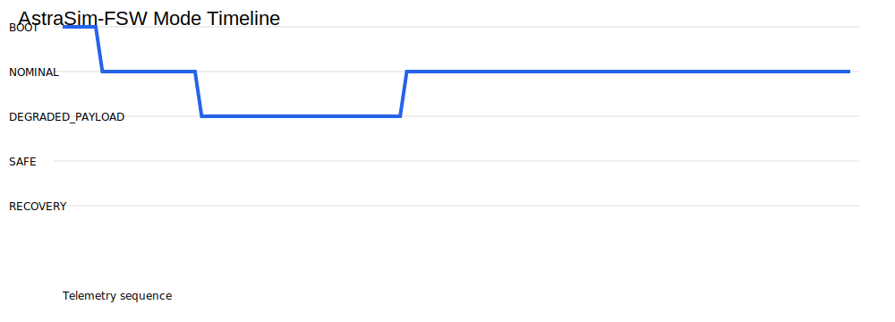
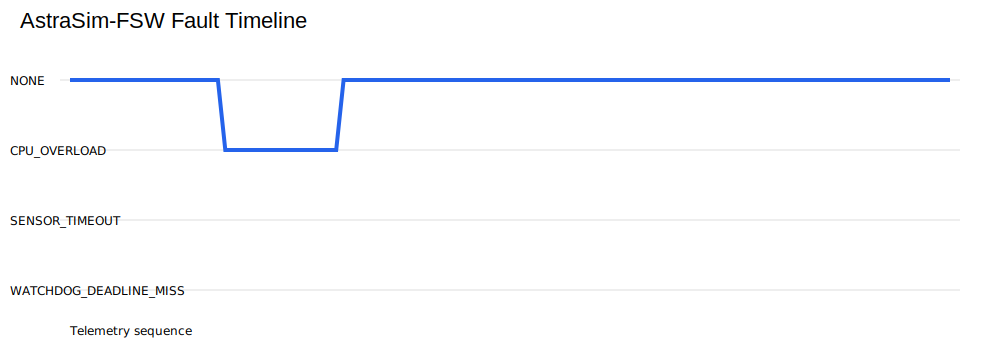

# AstraSim-FSW

[](https://github.com/XpiredRuby/AstraSim-FSW/actions/workflows/unit_tests.yml)

AstraSim-FSW is a C++/Python flight-software-in-the-loop simulation and verification framework.

The project uses C++ for the embedded flight-software core and Python for ground-side tooling, command injection, telemetry decoding, and repeatable demo capture. The intended hardware path is a Raspberry Pi acting as the embedded flight-software target and a laptop acting as the simulation, command, telemetry, and verification environment.

## Current Status

Implemented:

- C++17 flight software core
- CMake build system
- GitHub Actions CI
- BOOT / NOMINAL / DEGRADED / SAFE / RECOVERY mode manager
- Fault-driven mode transitions
- Binary telemetry packet serialization
- CRC-16-CCITT telemetry validation
- UDP telemetry sender
- Python telemetry receiver
- Binary command packet serialization
- CRC-16-CCITT command validation
- UDP command receiver
- Python command sender
- Command processor connected to the mode manager
- `FlightSoftwareApp` central app loop
- `HealthMonitor` for CPU, memory, sensor, payload, and loop health checks
- Automatic critical health-fault injection
- `Watchdog` for loop timing and stale execution detection
- Automatic watchdog fault injection
- Live UDP telemetry demo
- Integrated command/telemetry demo
- Verified command/telemetry evidence capture
- Automated demo capture reports

Current test coverage:

- Mode manager tests
- Telemetry packet tests
- UDP telemetry sender tests
- Command packet tests
- Command processor tests
- UDP command receiver tests
- Flight software app tests
- Health monitor tests
- Watchdog tests

Current local test status:

```text
9/9 test suites passing
```

## System Flow

```text
Python command sender
        |
        v
UDP command packet
        |
        v
C++ UDP command receiver
        |
        v
CommandPacket decoder + CRC validation
        |
        v
FlightSoftwareApp
        |
        +--> Watchdog
        |
        +--> HealthMonitor
        |
        +--> CommandProcessor
        |
        +--> ModeManager
        |
        v
TelemetryPacket encoder + CRC
        |
        v
C++ UDP telemetry sender
        |
        v
Python telemetry receiver
```

## Build and Test

From the project root:

```bash
bash ci/run_local_tests.sh
```

Manual build:

```bash
rm -rf build
mkdir -p build
cd build
cmake ..
make -j4
ctest --output-on-failure
```

## Main Executables

| Executable | Purpose |
|---|---|
| `astra_fsw` | Basic flight software mode/fault demo |
| `astra_fsw_telemetry_demo` | Sends live UDP telemetry to the Python receiver |
| `astra_fsw_command_telemetry_demo` | Receives UDP commands, updates mode/fault state through `FlightSoftwareApp`, and sends UDP telemetry |

## Python Tools

| Tool | Purpose |
|---|---|
| `tools/telemetry_receiver.py` | Receives and decodes AstraSim-FSW telemetry packets |
| `tools/send_command.py` | Sends binary UDP command packets |
| `tools/run_live_telemetry_demo.sh` | Automates telemetry sender/receiver demo capture |
| `tools/run_command_telemetry_demo.sh` | Automates full command/telemetry demo capture |

## Live Telemetry Demo

Run:

```bash
bash ci/run_local_tests.sh
tools/run_live_telemetry_demo.sh
```

This writes:

```text
reports/live_telemetry_demo_output.txt
```

## Command / Telemetry Demo

Run:

```bash
bash ci/run_local_tests.sh
tools/run_command_telemetry_demo.sh
```

This writes:

```text
reports/command_telemetry_demo_output.txt
```

Expected command sequence:

```text
SET_MODE NOMINAL
INJECT_FAULT CPU_OVERLOAD
CLEAR_FAULT
SET_MODE NOMINAL
```

Expected system behavior:

```text
BOOT -> NOMINAL
NOMINAL -> DEGRADED_PAYLOAD after CPU_OVERLOAD
Fault state clears after CLEAR_FAULT
DEGRADED_PAYLOAD -> NOMINAL after recovery command
```

## Evidence

| Evidence File | Shows |
|---|---|
| `evidence/command_telemetry_demo.txt` | Command receive, mode transition, fault injection, fault clear, and recovery to NOMINAL |
| `evidence/ctest_results.txt` | 9/9 local test suites passing |
| `reports/results_summary.md` | Scenario, Monte Carlo, unit-test, and requirement-check summary |
| `media/plots/mode_timeline.svg` | Mode timeline from command/telemetry evidence |
| `media/plots/fault_timeline.svg` | Fault timeline from command/telemetry evidence |
| `evidence/pi_ctest_results.txt` | Raspberry Pi aarch64 build with 9/9 local test suites passing |
| `evidence/pi_command_telemetry_demo.txt` | Raspberry Pi HIL command/telemetry run with fault injection and recovery |

## Results Plots





## Raspberry Pi HIL Demo

The flight software was built and executed on a Raspberry Pi running Ubuntu 24.04 aarch64. The Pi accepted UDP commands, emitted telemetry to the laptop dashboard, injected a CPU overload fault, cleared the fault, and recovered to NOMINAL.

Verified Pi evidence:

```text
SET_MODE NOMINAL -> accepted
INJECT_FAULT CPU_OVERLOAD -> DEGRADED_PAYLOAD
CLEAR_FAULT -> fault NONE
SET_MODE NOMINAL -> recovered
Pi ctest -> 9/9 passed
```

## Documentation

| Document | Purpose |
|---|---|
| `docs/architecture.md` | System architecture overview |
| `docs/requirements.md` | Initial requirements table |
| `docs/test_plan.md` | Test plan |
| `docs/live_telemetry_demo.md` | Live telemetry demo instructions |
| `docs/command_packet.md` | Command packet format |
| `docs/command_processor.md` | Command processor behavior |
| `docs/udp_command_receiver.md` | UDP command receiver design |
| `docs/command_telemetry_demo.md` | Integrated command/telemetry demo |
| `docs/flight_software_app.md` | Central app-loop behavior |
| `docs/health_monitor.md` | Health monitoring behavior |
| `docs/watchdog.md` | Watchdog behavior |

## Project Goal

The goal is to build a professional-grade simulation and flight-software verification framework that demonstrates:

- Embedded C++
- State-machine design
- Fault handling
- Watchdog logic
- Health monitoring
- Binary packet design
- UDP command and telemetry links
- Python ground tooling
- Automated verification
- Repeatable demo evidence
- GitHub Actions CI

## Planned Next Steps

- Connect real sensor/payload health inputs
