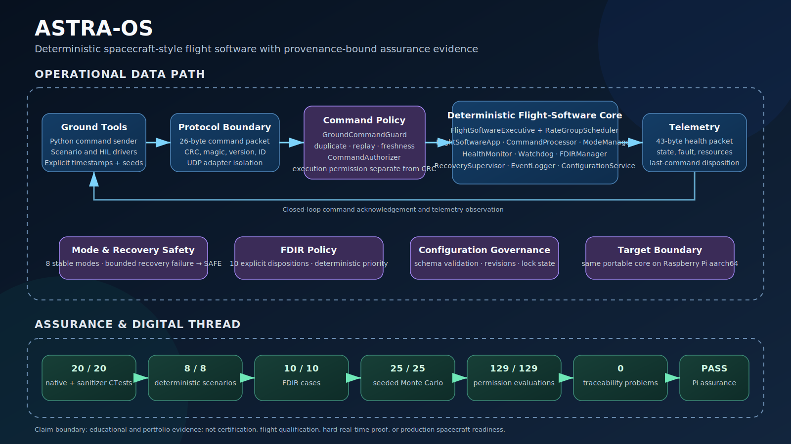

# ASTRA-OS / AstraSim-FSW



[](https://github.com/XpiredRuby/AstraSim-FSW/actions/workflows/unit_tests.yml)

ASTRA-OS v1.0.0 is an educational C++17 and Python spacecraft-style flight-software and assurance platform. It connects deterministic operating modes, UDP command and telemetry, command integrity and policy controls, health and watchdog monitoring, FDIR, bounded recovery, scheduling, configuration control, Raspberry Pi execution, requirements traceability, and reproducible verification evidence.

## Release and portfolio

- Release notes: [`RELEASE_NOTES_v1.0.0.md`](RELEASE_NOTES_v1.0.0.md)
- Recruiter-readable case study: [`docs/PORTFOLIO_CASE_STUDY.md`](docs/PORTFOLIO_CASE_STUDY.md)
- Ready-to-record 90-second demo: [`docs/PORTFOLIO_DEMO.md`](docs/PORTFOLIO_DEMO.md)
- Final completion report: [`reports/ASTRA_OS_FINAL_COMPLETION_REPORT.md`](reports/ASTRA_OS_FINAL_COMPLETION_REPORT.md)

## Current completion status

The final portable-software baseline has locally passed. The complete managed assurance campaign reported `overall_status: passed` for software-under-test commit `bdd207a396c3054e3eeb74479798110e29b3d1eb`.

| Verification area | Current result |
|---|---:|
| Native CTest | 20/20 |
| Declared deterministic scenarios | 8/8 |
| Ten-case FDIR campaign | 10/10 |
| Protocol conformance | 24/24 |
| Seeded Monte Carlo | 25/25 with seed `20260626` |
| Python tool tests | 28/28 |
| Frozen assurance-assistant evaluation | 129/129 |
| Canonical planned requirements | 0 |
| Requirement failures | 0 |
| Traceability problems | 0 |

The prior Raspberry Pi release-closure campaign remains preserved in `reports/ASTRA_OS_RASPBERRY_PI_VERIFICATION_REPORT.md`. It verified the predecessor baseline with 18 CTest suites and five deterministic scenarios. The completion branch extends that baseline with command authorization, timestamp scenarios, bounded recovery, two additional CTest suites, three additional declared scenarios, the ten-fault campaign, digital-thread enforcement, and frozen permission evaluation.

## Claim boundary

ASTRA-OS is a portfolio and educational project. Its evidence does **not** establish:

- certification or DO-178C compliance;
- flight qualification or airworthiness;
- hard-real-time or worst-case-execution-time guarantees;
- production readiness or operational reliability;
- cryptographic command authentication;
- radiation tolerance;
- compatibility with spacecraft hardware.

Raspberry Pi timing campaigns are documented host execution measurements rather than real-time qualification.

## Implemented capabilities

### Flight-software core

- BOOT NOMINAL DEGRADED_SENSOR DEGRADED_PAYLOAD SAFE RECOVERY STANDBY and TEST;
- deterministic transition validation;
- health and watchdog reports;
- ten-fault FDIR disposition and simultaneous-fault priority;
- bounded recovery supervision;
- rate-group scheduler and executive dispatch;
- versioned configuration revision control and lock;
- bounded typed event logging.

### Command and telemetry

- fixed binary packet layouts and CRC-16-CCITT;
- UDP command receiver and telemetry sender;
- Python sender and decoder;
- duplicate replay stale and future command rejection;
- configurable command-execution authorization policy;
- typed telemetry acknowledgements including unauthorized and recovery-limit rejections;
- C++ Python and manifest protocol consistency checking.

CRC detects corruption under the tested model. It does not authenticate a sender. `CommandAuthorizer` is execution policy rather than cryptographic identity authentication.

### Verification and assurance

- 20 native CTest suites;
- eight deterministic YAML scenarios;
- ten-case FDIR command/telemetry campaign;
- seeded Monte Carlo regression;
- ASan and UBSan;
- clang-tidy;
- aggregate and per-module LCOV evidence;
- controlled CRC mutation;
- bounded libFuzzer campaign and deterministic seed corpus;
- timing jitter CPU memory temperature and soak evidence;
- deployment packaging;
- provenance manifests;
- reverse CTest-to-requirement allocation;
- reviewed requirement fingerprints and controlled-interface hashes;
- deterministic governed-assistant policy with 129 frozen cases.

## System flow

```text
Python sender or YAML scenario
        |
        v
UDP command packet
        |
        v
CommandPacket decode and CRC
        |
        v
GroundCommandGuard
  - timestamp age and future skew
  - duplicate replay and wrap policy
        |
        v
CommandAuthorizer
  - configurable command and TEST policy
        |
        v
CommandProcessor
  - semantic command validation
  - RecoverySupervisor
  - FDIRManager
        |
        v
ModeManager and active fault

HealthMonitor -----+
Watchdog ----------+--> internal fault selection

FlightSoftwareExecutive
  - RateGroupScheduler
  - FlightSoftwareApp
  - housekeeping
        |
        v
TelemetryPacket and EventLogger
        |
        v
UDP telemetry receiver and evidence reports
```

## Native Raspberry Pi build

```bash
cmake -S . -B build-pi \
  -DCMAKE_BUILD_TYPE=Release \
  -DASTRA_WARNINGS_AS_ERRORS=ON
cmake --build build-pi --parallel
ctest --test-dir build-pi --output-on-failure
```

Expected current suite:

```text
20/20 tests passing
```

## Complete assurance workflow

```bash
python3 tools/run_astra_os_assurance.py --build-dir build-pi
```

This runs full verification, sanitizers, controlled mutation, and provenance generation. The final machine-readable status is written to:

```text
reports/latest/assurance_summary.json
```

## Deterministic scenarios

```bash
python3 tools/run_all_scenarios.py \
  --build-dir build-pi \
  --skip-build \
  --skip-monte-carlo \
  --skip-pi-package
```

Declared scenarios:

- `basic_command_fault.yaml`
- `command_timestamp_guard.yaml`
- `extended_modes.yaml`
- `hil_smoke_test.yaml`
- `invalid_transition_rejected.yaml`
- `recovery_failure_failsafe.yaml`
- `sensor_timeout_safe_mode.yaml`
- `watchdog_timeout_safe_mode.yaml`

## Ten-case FDIR campaign

```bash
python3 tools/run_fdir_campaign.py --build-dir build-pi
```

The campaign verifies the software disposition for every supported fault through the UDP command/telemetry boundary. It does not prove every physical detector.

## Seeded Monte Carlo

```bash
python3 tools/run_monte_carlo.py \
  --build-dir build-pi \
  --trials 25 \
  --seed 20260626
```

## Digital-thread gate

```bash
python3 tools/check_requirements.py
```

The gate checks requirement and matrix consistency, scenario references, reverse allocation of all CTests, reviewed requirement fingerprints, and controlled-interface hashes.

Intentional reviewed changes are frozen with:

```bash
python3 tools/update_traceability_baseline.py
```

## Governed assurance assistant

Dry-run an authorization request:

```bash
python3 tools/assurance_assistant.py \
  --request '{"action":"run","target":"check_protocol_conformance"}'
```

Execute an approved request:

```bash
python3 tools/assurance_assistant.py \
  --request '{"action":"run","target":"check_protocol_conformance"}' \
  --execute
```

Run the frozen evaluation:

```bash
python3 tools/run_assurance_assistant_eval.py
```

The assistant interface cannot merge push run arbitrary shell commands issue hardware commands write project files delete data or mark requirements verified.

## Raspberry Pi deployment package

```bash
bash tools/package_pi_deployment.sh --build-dir build-pi
```

The archive contains the two target binaries ground command and telemetry tools eight scenarios the ten-case FDIR campaign protocol manifest and operational-policy documentation. Package generation is separate from hardware execution.

## Primary evidence

| Evidence | Purpose |
|---|---|
| `reports/ASTRA_OS_FINAL_COMPLETION_REPORT.md` | Final 20-test completion campaign provenance results timing resources and limitations |
| `reports/ASTRA_OS_RASPBERRY_PI_VERIFICATION_REPORT.md` | Previous Pi campaign provenance results defects and limitations |
| `reports/requirement_check_report.md` | Canonical requirement and digital-thread result |
| `reports/fdir_campaign_report.md` | Ten independently injected fault dispositions |
| `reports/assurance_assistant_eval.md` | 129-case permission evaluation |
| `reports/monte_carlo_report.md` | Seeded randomized regression |
| `reports/pi_deployment_package_report.md` | Target bundle contents and checksum |
| `reports/pi-hil/` | Pi timing resource and CTest evidence |
| `reports/latest/` | Selected assurance protocol sanitizer mutation and provenance artifacts |

## Key tools

| Tool | Purpose |
|---|---|
| `tools/run_scenario.py` | Execute one deterministic YAML scenario |
| `tools/run_all_scenarios.py` | Run aggregate verification gates |
| `tools/run_fdir_campaign.py` | Verify all ten fault dispositions |
| `tools/run_monte_carlo.py` | Reproducible randomized regression |
| `tools/check_protocol_conformance.py` | Cross-language protocol comparison |
| `tools/check_requirements.py` | Digital-thread and reverse-test validation |
| `tools/run_assurance_assistant_eval.py` | Frozen permission evaluation |
| `tools/run_astra_os_assurance.py` | Full assurance orchestration |
| `tools/package_pi_deployment.sh` | Explicit-build target packaging |

## Documentation

- `docs/ARCHITECTURE.md`
- `docs/REQUIREMENTS.md`
- `docs/VERIFICATION_MATRIX.csv`
- `docs/ASSURANCE.md`
- `docs/FDIR_MATRIX.md`
- `docs/command_authorization.md`
- `docs/recovery_supervisor.md`
- `docs/RISKS_AND_BLOCKERS.md`

## Repository safety

All completion work is confined to:

```text
/home/xpired/ghost_ws/tools/astra-os-hil
```

The historical dirty preservation worktree remains untouched.
