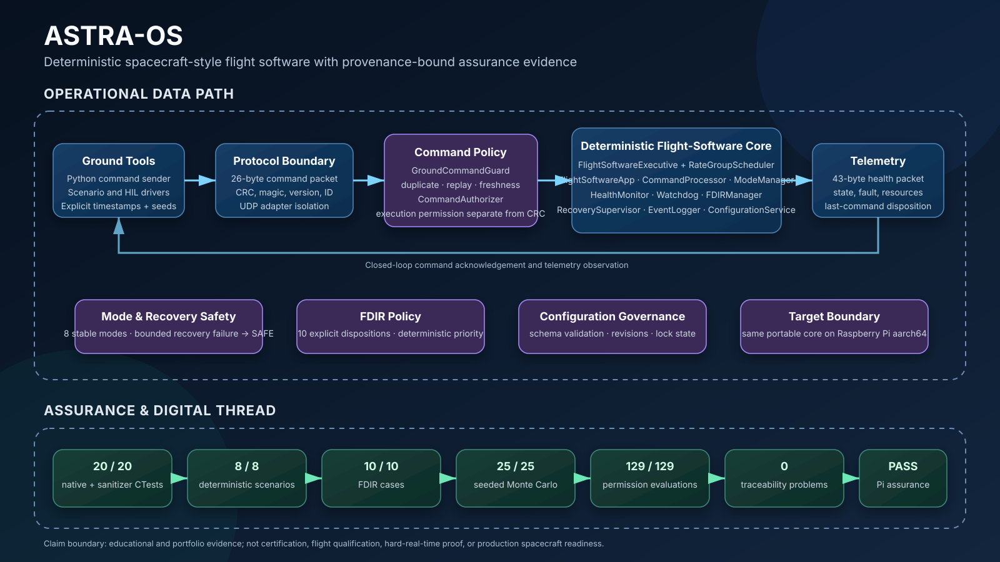
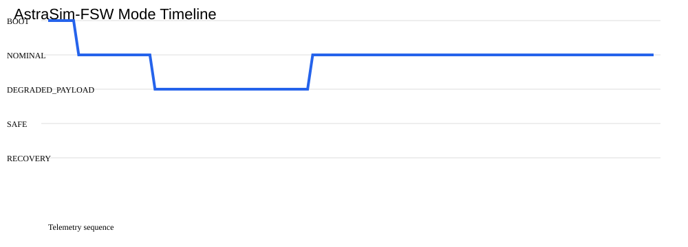
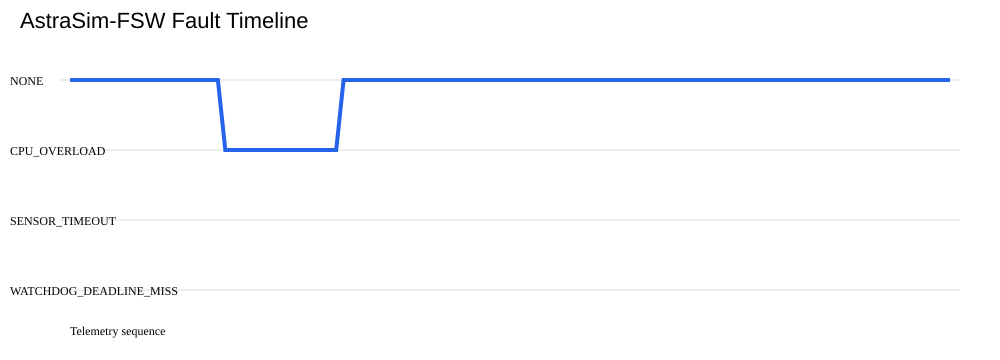

# ASTRA-OS

**Spacecraft-style flight software and assurance on a portable C++17 core.** ASTRA-OS implements deterministic modes, command/telemetry, fault management, bounded recovery, configuration control, and verification tooling, with preserved native Raspberry Pi execution evidence.

[](https://github.com/XpiredRuby/AstraSim-FSW/actions/workflows/unit_tests.yml)
[](https://github.com/XpiredRuby/AstraSim-FSW/actions/workflows/assurance.yml)
[](https://xpiredruby.github.io/AstraSim-FSW/)


**[Launch the interactive mission console](https://xpiredruby.github.io/AstraSim-FSW/)** · **[Final completion report](reports/ASTRA_OS_FINAL_COMPLETION_REPORT.md)** · **[Architecture](docs/ARCHITECTURE.md)** · **[Requirements](docs/REQUIREMENTS.md)**

> **Evidence boundary:** this is an educational software-engineering project. It demonstrates spacecraft-style flight-software architecture and verification practice. It is **not** certified or flight-qualified software, does not establish hard-real-time/WCET guarantees, and has not been integrated with representative spacecraft buses, sensors, actuators, radiation environments, or operational mission hardware.



---

## What the project demonstrates

### Flight-software core

- Eight deterministic modes: `BOOT`, `NOMINAL`, `DEGRADED_SENSOR`, `DEGRADED_PAYLOAD`, `SAFE`, `RECOVERY`, `STANDBY`, and `TEST`.
- Deterministic rate-group scheduling and executive dispatch.
- Health monitoring, watchdog handling, typed events, and revisioned/lockable configuration.
- Ten explicit FDIR dispositions with simultaneous-fault priority and bounded recovery supervision.

### Command and telemetry boundary

- Fixed binary UDP command and telemetry packet layouts.
- CRC-16-CCITT integrity checks plus version, length, and command validation.
- Duplicate/replay protection and stale/future timestamp rejection.
- A separate `CommandAuthorizer` execution-policy layer.
- Typed acknowledgements for accepted and rejected commands.

CRC is an integrity check under the tested corruption model. It is **not sender authentication**, and `CommandAuthorizer` is execution policy rather than cryptographic identity.

### Assurance and configuration control

- Requirement-to-verification traceability and reverse CTest allocation.
- Reviewed requirement fingerprints and controlled-interface SHA-256 hashes.
- ASan/UBSan, clang-tidy, structural coverage, bounded libFuzzer, controlled mutation, seeded Monte Carlo, protocol-conformance, timing/soak, and provenance workflows.
- A deterministic governed-assurance interface evaluated against 129 frozen allow/deny cases.

NASA software-assurance guidance emphasizes repeatable test procedures, bidirectional traceability, off-nominal verification, and objective evidence. ASTRA-OS is not a NASA-certified process implementation, but those engineering habits are intentionally reflected in the project structure.

## Verification snapshot

The table below describes the **current repository tree**. Historical release reports preserve the exact counts and toolchain from their own tested baselines; those counts are not silently rewritten when new tests are added later.

| Area | Current result |
|---|---:|
| Native CTest suites | **20 / 20** |
| Python tool + browser-model tests | **35 / 35** |
| Deterministic scenarios | **8 / 8** |
| FDIR fault campaign | **10 / 10** |
| Protocol conformance | **24 / 24** |
| Seeded Monte Carlo (`20260626`) | **25 / 25** |
| Frozen assurance-assistant evaluation | **129 / 129** |
| Requirement failures | **0** |
| Traceability problems | **0** |

The current Python count is verified by the repository CI. The v1.0.0/final-completion artifacts retain their earlier 27/28-test counts because they describe earlier frozen commits rather than the evolving `main` branch.

| Mode timeline | Fault timeline |
|---|---|
|  |  |

## Native Raspberry Pi evidence

A frozen release-closure campaign built and executed the portable core natively on Ubuntu 24.04 `aarch64` with a Raspberry Pi kernel. The exact board/SoC model was not available from the collection interface, so the repository does not guess it.

That campaign includes native CTest execution, deterministic command/fault scenarios, protocol checks, Monte Carlo regression, timing/soak measurements, resource observations, and a reproducible deployment package. See [`reports/ASTRA_OS_RASPBERRY_PI_VERIFICATION_REPORT.md`](reports/ASTRA_OS_RASPBERRY_PI_VERIFICATION_REPORT.md).

This is **native target execution evidence**, not proof of spacecraft hardware-in-the-loop integration. The timing campaigns are observed faster-than-real-time process measurements, not schedulability or hard-real-time qualification.

## Command path

```text
Python sender / scenario runner
        │
        ▼  UDP command packet
CommandPacket decode + CRC
        │
        ▼
GroundCommandGuard
  freshness · future skew · duplicate/replay
        │
        ▼
CommandAuthorizer
  execution policy
        │
        ▼
CommandProcessor
        │
        ├────────► RecoverySupervisor
        └────────► FDIRManager
        │
        ▼
ModeManager + active fault

HealthMonitor ─┐
Watchdog ──────┴────► internal fault selection

FlightSoftwareExecutive
  RateGroupScheduler · application · housekeeping
        │
        ▼
TelemetryPacket + EventLogger
        │
        ▼
Python decoder / verification evidence
```

## Run it

Build and execute the portable C++ test suite:

```bash
cmake -S . -B build -DCMAKE_BUILD_TYPE=Release -DASTRA_WARNINGS_AS_ERRORS=ON
cmake --build build --parallel
ctest --test-dir build --output-on-failure
```

Run the managed assurance campaign:

```bash
python3 tools/run_astra_os_assurance.py --build-dir build
```

Selected gates:

```bash
python3 tools/run_all_scenarios.py --build-dir build --skip-build --skip-monte-carlo --skip-pi-package
python3 tools/run_fdir_campaign.py --build-dir build
python3 tools/run_monte_carlo.py --build-dir build --trials 25 --seed 20260626
python3 tools/check_protocol_conformance.py
python3 tools/check_requirements.py
python3 -m unittest discover -s tools/tests -p 'test_*.py'
```

## Interactive console

The browser console mirrors the documented modes, faults, guards, scenarios, and release metrics so a reviewer can exercise the state-machine behavior without building the project.

**It is a browser model, not the native C++ executable, a WebAssembly build, the Raspberry Pi process, or mission-control software.** Its schema and expected values are checked by repository tests.

[Launch the console](https://xpiredruby.github.io/AstraSim-FSW/)

## Scope

**Demonstrated**

- deterministic mode/state-machine behavior;
- binary UDP command and telemetry interfaces;
- integrity, freshness, replay, and execution-policy checks;
- explicit FDIR and bounded recovery policy;
- native Raspberry Pi/aarch64 execution evidence;
- deterministic and randomized verification campaigns;
- controlled mutation, fuzzing, sanitizers, static analysis, and coverage;
- requirement/test traceability and provenance-bound evidence.

**Not established**

- certification or DO-178C compliance;
- flight qualification, airworthiness, or production readiness;
- hard-real-time or WCET guarantees;
- cryptographic sender authentication or key management;
- radiation tolerance;
- compatibility with representative spacecraft avionics, buses, sensors, actuators, or payloads;
- operational reliability or mission readiness.

## Evidence index

| Artifact | Purpose |
|---|---|
| [`reports/ASTRA_OS_FINAL_COMPLETION_REPORT.md`](reports/ASTRA_OS_FINAL_COMPLETION_REPORT.md) | Frozen portable-software completion baseline |
| [`reports/ASTRA_OS_RASPBERRY_PI_VERIFICATION_REPORT.md`](reports/ASTRA_OS_RASPBERRY_PI_VERIFICATION_REPORT.md) | Native Pi execution, defects, timing and target evidence |
| [`reports/requirement_check_report.md`](reports/requirement_check_report.md) | Requirement and reverse-test allocation status |
| [`reports/fdir_campaign_report.md`](reports/fdir_campaign_report.md) | Ten independently exercised fault dispositions |
| [`reports/monte_carlo_report.md`](reports/monte_carlo_report.md) | Seeded randomized regression |
| [`reports/assurance_assistant_eval.md`](reports/assurance_assistant_eval.md) | Frozen permission-boundary evaluation |
| [`reports/pi_deployment_package_report.md`](reports/pi_deployment_package_report.md) | Deployment bundle contents and checksum |
| [`reports/latest/`](reports/latest/) | Generated protocol, assurance and provenance artifacts |

## Documentation

[Architecture](docs/ARCHITECTURE.md) · [Requirements](docs/REQUIREMENTS.md) · [Verification matrix](docs/VERIFICATION_MATRIX.csv) · [Assurance](docs/ASSURANCE.md) · [FDIR matrix](docs/FDIR_MATRIX.md) · [Command authorization](docs/command_authorization.md) · [Recovery supervisor](docs/recovery_supervisor.md) · [Risks and blockers](docs/RISKS_AND_BLOCKERS.md) · [Portfolio case study](docs/PORTFOLIO_CASE_STUDY.md)

## Stack

`C++17` · `CMake` · `CTest` · `Python` · `UDP` · `CRC-16-CCITT` · `YAML` · `GitHub Actions` · `Raspberry Pi / aarch64`

## License

MIT. See [`LICENSE`](LICENSE).

## Author

**Vinayak Manoj Nair** · B.S. Aerospace Engineering, Texas A&M University

Technical review, reproducibility feedback, and flight-software/verification discussion are welcome through GitHub issues.
